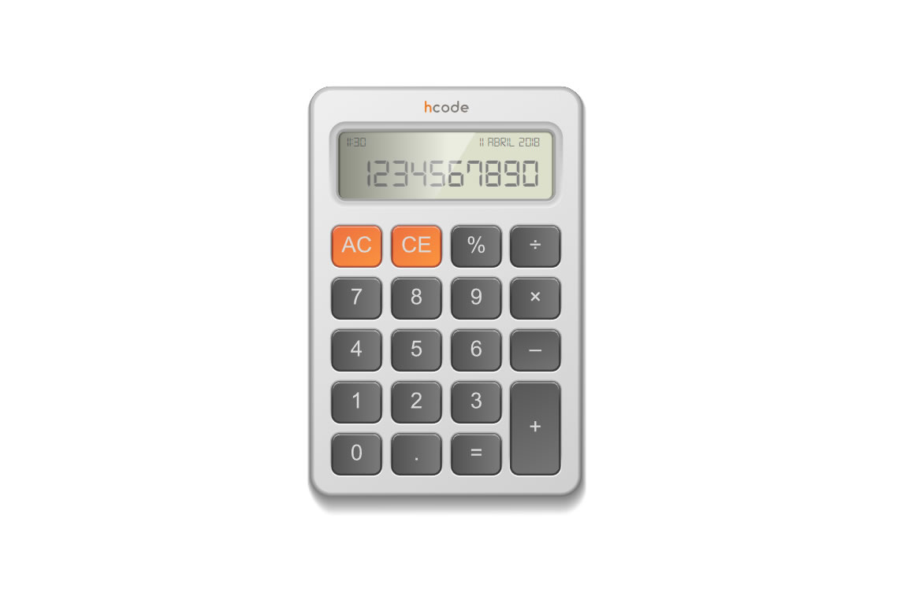

# Simple Calculator

> A simple calculator to demonstrate the use of ES6

## Browser Support

 |  |  |  |  |
--- | --- | --- | --- | --- |
39+ ✔ | 42+ ✔ | 29+ ✔ | 10.1+ ✔ | Nope ✘ |

## How to Run
Install the dependencies with `npm i`.

> To turn on the sound just double click the `AC` button;

## License

This project is licensed under the MIT License - see the [LICENSE.md](LICENSE.md) file for details
